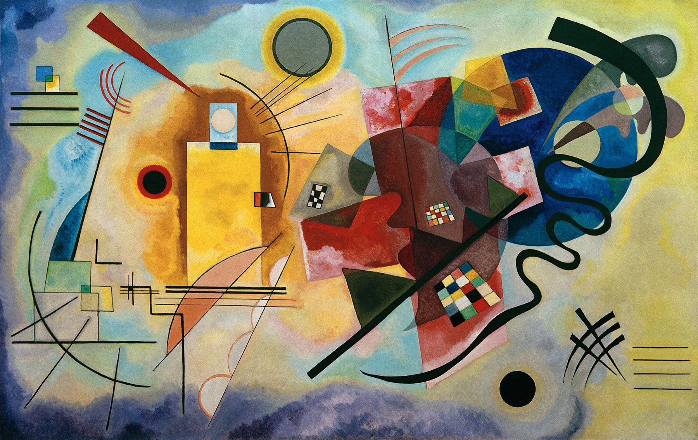
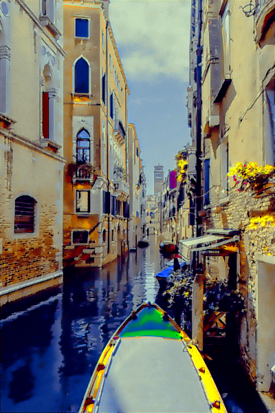
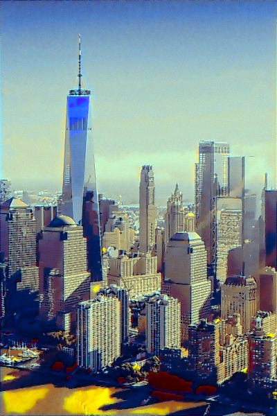
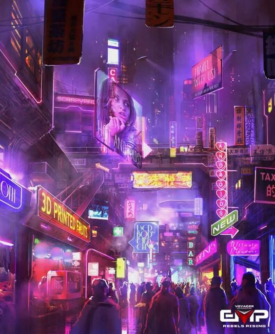
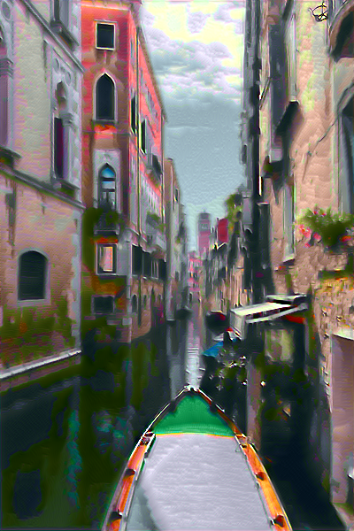

# Style Transfer Tutorial

The simplest code for neural style transfer code using PyTorch.

| Content | Style | Result |
| --- | --- | --- |
|  |  |  |
|  |  |  |
|  |  |  |

## Run

```
python style_transfer.py
```

## Dependency

- Python 3
- torch==1.7
- pillow
- tqdm

## Reference

- https://junklee.tistory.com/69
- https://keras.io/examples/generative/neural_style_transfer/
- https://github.com/titu1994/Neural-Style-Transfer
